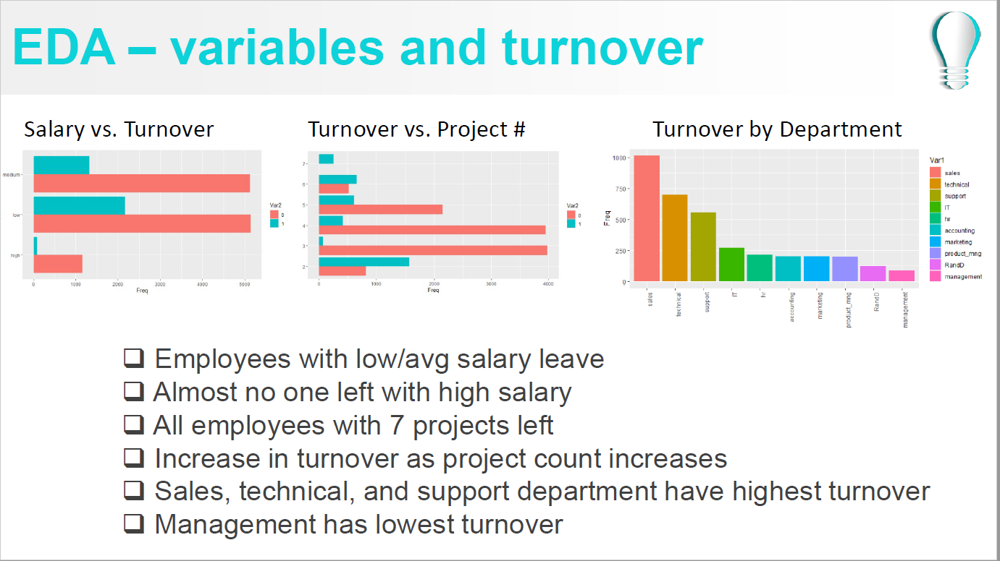
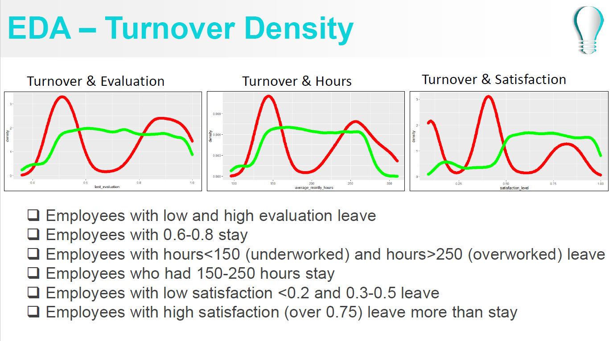
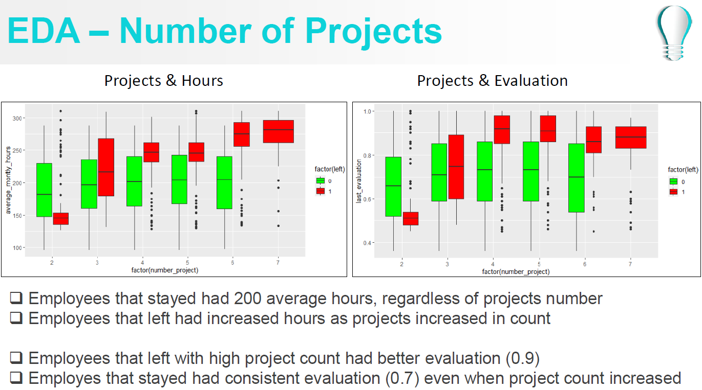
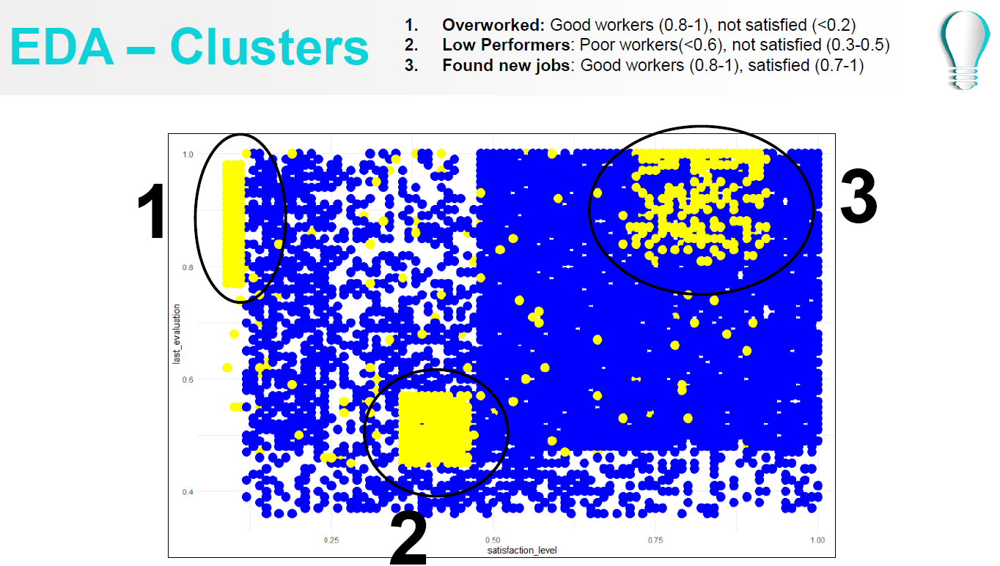
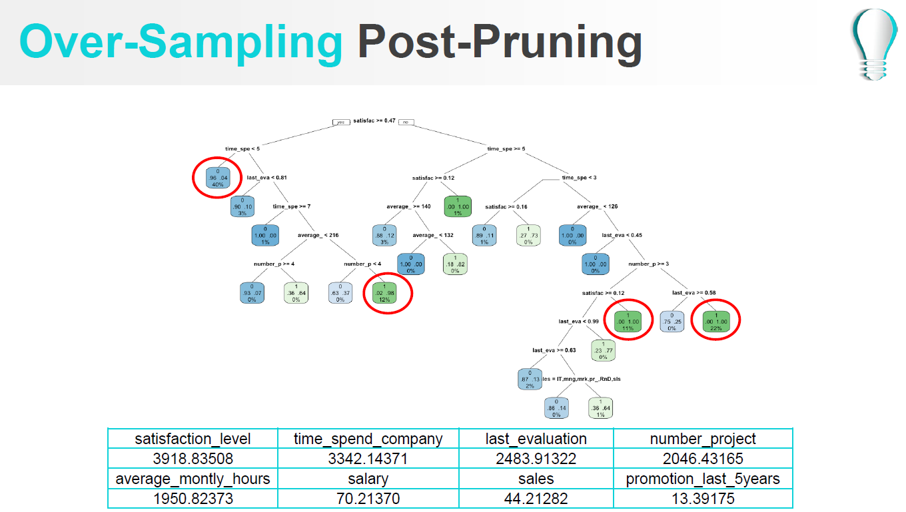
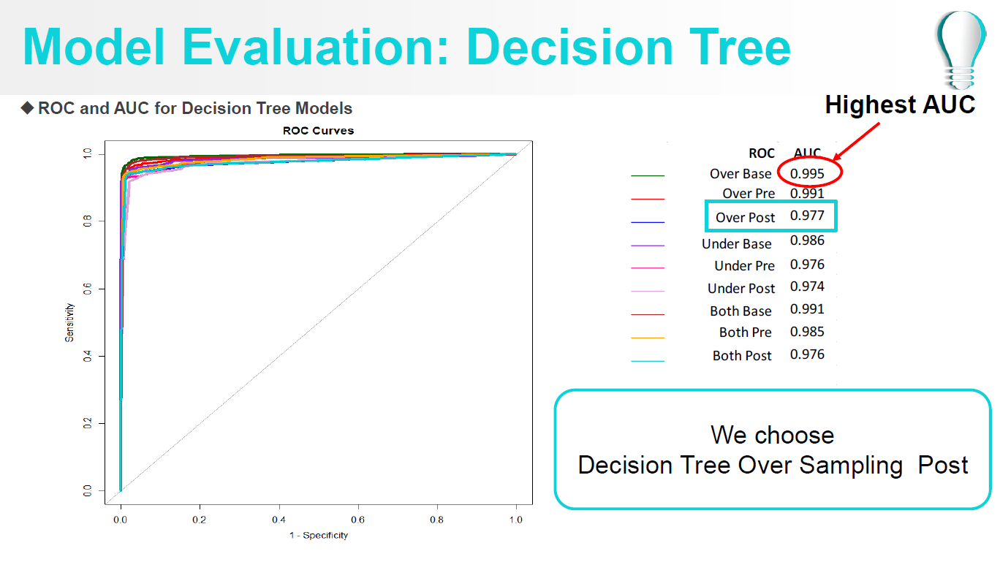
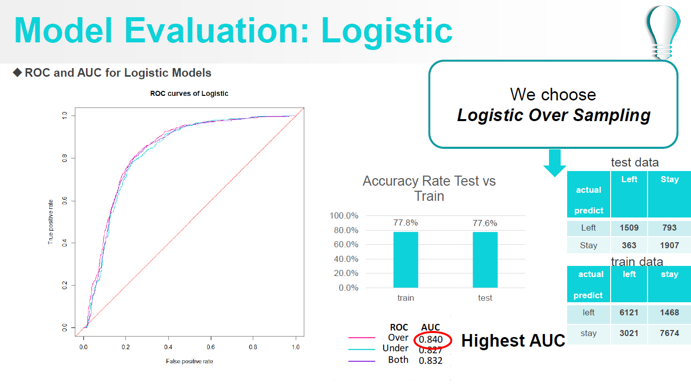
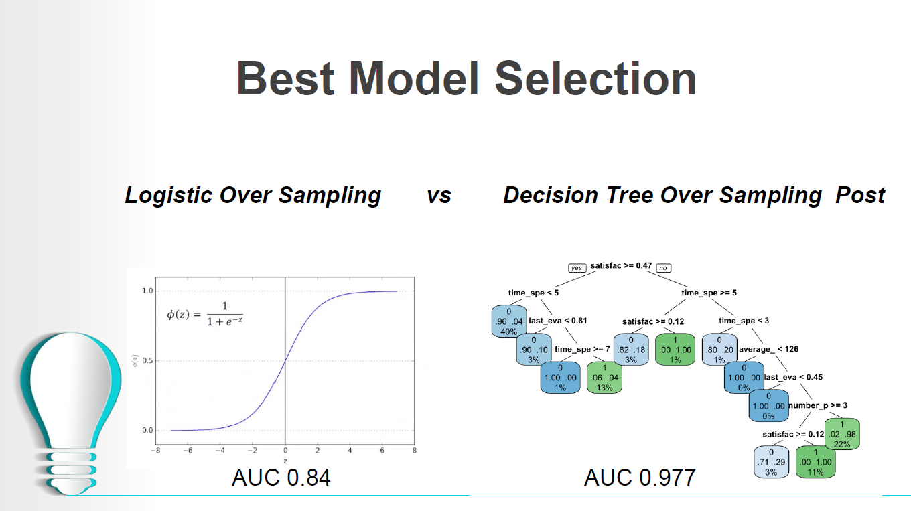

# HR-Analytics
HR Analytics in Rmarkdown

# Code:
https://github.com/trajceskijovan/HR-Analytics/blob/main/Code.R

# Presentation (deck):
https://github.com/trajceskijovan/HR-Analytics/blob/main/Presentation.pdf

# Analytical Insights Samples:

